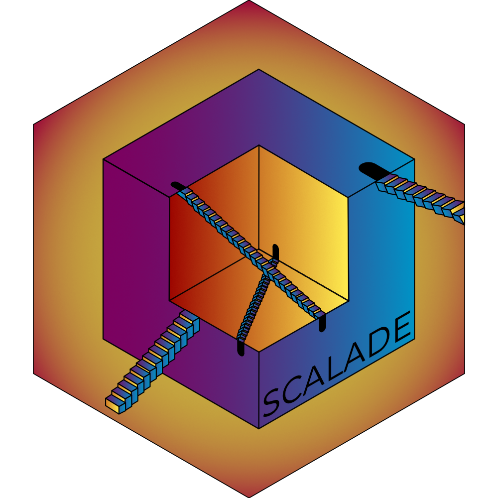

<!-- README.md is generated from README.Rmd. Please edit that file -->

# scalade 

<!-- badges: start -->

[](https://lifecycle.r-lib.org/articles/stages.html#experimental)
<!-- badges: end -->

The goal of scalade is to ease the process of loading a whole bunch of
related libraries. This is done by organizing packages into “ladders”,
where each rung can be thought of as an individual package. For any
given project, there are a host of packages to load, and it isn’t all
too rare to see the list of libraries become longer than the script
itself. Thus, this is just one way lightweight way of addressing the
ever-growing list of libraries you’ll be using for any given
script/project.

## Installation

You can install the development version from
[GitHub](https://github.com/) with:

``` r
# install.packages("devtools")
devtools::install_github("robertamezquita/scalade")
```

## Usage

### What are Ladders?

Ladders are the term used herein for collections of packages organized
under some identifier, e.g. “my\_analysis\_pkgs” is associated with
“dplyr”, “tidyr”, “ggplot2”…etc.

### Setup a New Ladder Definition

First, we need to setup the scalade framework:

``` r
## library(scalade)
scalade::setup(mode = "home")
```

This will create the necessary `~/.Rscalade` file that will hold the
ladder definitions. The scalade package already includes some prebuilt
ladders that are used to create the basis of the ladder definition file,
`~/.Rscalade`. This file will store your ladders so you can load them in
future sessions easily.

Note that you don’t have to keep the `.Rscalade` file in your home
directory (`~`), you can make it for a specific project too. To do this,
set `mode = "local"` to automagically infer your project root (via
`here::here()`) and create a new `.Rscalade` there. Else, it can be
specified manually via `mode = "manual"`, and the `.scalade` argument
can be filled in with the desired path,
e.g. `.scalade = "/path/to/my/new/.Rscalade"`.

Also note that almost all the functions in this package support a
`.scalade = <file>` argument to specify the ladder definition you want
to work with.

### Affix the Ladder

To explicitly set the ladder definition to use for your session, use
`scalade::affix()`, which will write to your `options()` by setting
`options(scalade.rscalade = "/path/to/.Rscalade")`. Unless changed with
another `scalade::affix()`, this will remain the ladder definition used
throughout the other functions implicitly (e.g. no need to set
`.scalade`).

``` r
scalade::affix(here::here(".Rscalade"))
#> ✔ Setting .Rscalade to existing ladder definition:
#> /Users/rob/Library/Mobile Documents/com~apple~CloudDocs/Projects/infrastructure/_single-cell/scalade/.Rscalade
```

### The Ladder Definitions

The format of `~/.Rscalade` is tidy, as shown in the predefined ladders
provided as part of the package below:

``` r
data(scalade_prebuilt)
scalade_prebuilt[1:5, ]
#> # A tibble: 5 x 3
#>   id            repo  package 
#>   <chr>         <chr> <chr>   
#> 1 pretty_prompt CRAN  cli     
#> 2 pretty_prompt CRAN  crayon  
#> 3 pretty_prompt CRAN  pillar  
#> 4 development   CRAN  devtools
#> 5 development   CRAN  usethis
```

The three key aspects here are the `id` (some meaningful name for the
ladder e.g. family of packages), the source `repo` (one of CRAN,
Bioconductor, or Remote (for Github)), and the package name itself under
`package`.

To view what is already available in our `~/.Rscalade` definition, we
can call upon a pretty printing method to show us what our ladders are,
what repo they’re from, and if we already have the package installed or
not and if so what version we have:

``` r
scalade::inspect('bioc_sc_methods')
#> ✔ Using preset .Rscalade from `options(scalade.rscalade)`:
#> /Users/rob/Library/Mobile Documents/com~apple~CloudDocs/Projects/infrastructure/_single-cell/scalade/.Rscalade
#> ── bioc_sc_methods ────────────────────────────────────────────────────────────────────────────────────────────────────── Bioconductor ──
#> ✔ SingleCellExperiment 1.12.0     ✔ batchelor            1.6.2 
#> ✔ scuttle              1.0.4      ✔ zellkonverter        1.0.3 
#> ✔ scran                1.18.5     ✔ scDblFinder          1.4.0 
#> ✔ DropletUtils         1.10.3     ✔ SingleR              1.4.1
#> 
```

### Installing & Upgrading Ladders

We see we have a (prebuilt) ladder called `bioc_sc_methods` (single-cell
methods from Bioconductor). We have most of the packages already
(indicated by the checkmark), but there may be cases where we don’t have
all of them. In case of any missing packages (marked by an X), or even
if we just want to upgrade our ladder, we can install/upgrade via:

``` r
scalade::transport('bioc_sc_methods')
```

### Creating (and Destroying) Ladders

This can be thought of as “transporting” the ladder from some store
(repository) to your home.

Now, let’s say we want to create a new ladder definition. We can do that
either by directly interactively editing the ladder file via
`scalade::liveedit()` or by creating new entries via
`scalade::construct()`:

``` r
scalade::construct(
  id = 'my_favorites', 
  repo = 'CRAN', 
  packages = c('dplyr', 'tidyr', 'purrr')
)
```

Great! But maybe later we will have new favorite packages and want to
clean up our ladder collection - in that case we can destroy existing
ladders:

``` r
scalade::burn('my_favorites', overwrite = TRUE)
```

To prevent any accidents, setting the `overwrite = TRUE` argument is
required.

### Attaching Ladders

Finally, we come to the best part: actually using our ladders! We can
attach a ladder or even multiple ladders to our project (e.g. load all
the packages for a given set of ladders) via:

``` r
scalade::climb('tidypkgs')
scalade::climb(c('viz_static', 'networks'))
```

``` r
scalade::climb('viz_static')
#> ── Attaching packages ───────────────────────────────────────────────────────────────────────────────────────────────────── viz_static ──
#> ✔ ggplot2          3.3.3     ✔ ggforce          0.3.2
#> ✔ httpgd           1.0.1     ✔ scico            1.2.0
#> ✔ ragg             1.1.1     ✔ hierarchicalSets 1.0.2
#> ✔ patchwork        1.1.1
```

Thus, for your projects, in lieu of library you can call upon the
`climb()` function to load your family of functions all at once.

### Portability

To make the project portable the ladder definition file would also have
to be shared. To make this easier without having to overwrite a friend’s
`~/.Rscalade`, you can create such ladder definition files in an ad-hoc
manner; all the `*()` functions support arbitrary `.Rscalade` style
files via the `.scalade = <file.Rscalade>` option, e.g.:

``` r
scalade::climb('my_project_pkgs', .scalade = here::here('project_v1.Rscalade'))
```

Note that even if you have a globally set .Rscalade as set by
`scalade::affix()` that providing the `.scalade` argument will override
that. This applies to all the functions. See `.check_rscalade()` for
details on the search path.

## Contributions

Always welcome, please feel free to add ladders (see
`data-raw/predefined-ladders.R`) and make PRs to enhance the package.

## Inspiration

This was *heavily* lifted from the [tidyverse meta
package](https://github.com/tidyverse/tidyverse). I found that I was
using this package as a template for other `"*verses"` I was working on,
and wanted to come up with a way to generalize this style of loading
packages all at once. It’s nice to not have to type in the same set of
packages over and over again!

The name and theme comes from the act of building ladders to scale a
castle’s fortifications. The ladders are thus handy helpers when it
comes to tackling that big project (the castle) that requires all the
libraries under the sun.
